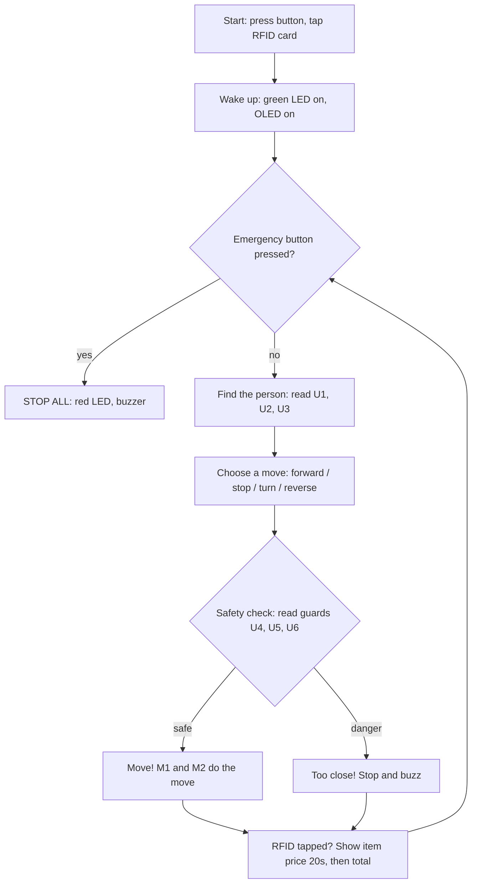

# Cart-E — Human-Following Trolley: Flowchart & Logic Cases

**Microcontroller:** ESP32 (Arduino IDE)
**Audience:** Explainable to Year 6 primary school students

---

## 1. The Six Eyes (Ultrasonic Sensor Layout)

The trolley has **6 ultrasonic sensors**. Explain it to students like this:
*"The trolley has 6 eyes. One eye watches the friend in front, two eyes help it turn, and three eyes are bodyguards that stop it from bumping into things."*

```
            [ Person ]
                |
        +------[U1]------+
        |                |
      [U2]             [U3]      <- front corners (turning eyes)
        |    CART-E      |
        |   (top view)   |
        |                |
      [U4]             [U5]      <- back corners (side guards)
        +------[U6]------+       <- back guard
```

| Sensor | Position | Job |
|--------|----------|-----|
| U1 | Front center | **Front eye** — watches the person and measures the distance |
| U2 | Front left | **Turning eye** — sees gaps/person on the left |
| U3 | Front right | **Turning eye** — sees gaps/person on the right |
| U4 | Back left | **Side guard** — keeps away from racks on the left |
| U5 | Back right | **Side guard** — keeps away from racks on the right |
| U6 | Back center | **Back guard** — makes reversing safe |

**Wheels:** M1 = left wheel motor, M2 = right wheel motor.

## 2. Other Components

- Push button — start / on / off
- Emergency push button — stop everything immediately
- LED red + LED green (optionally yellow) — status indicators
- Li-ion battery — power
- RFID reader (PN532) + RFID tag stickers (13.56 MHz NTAG213) — item scanning
- OLED screen — shows scanned item price for **20 seconds**, then returns to total price
- Buzzer — warns when the person moves too fast for the sensor to follow

## 3. Main Program Flowchart

The ESP32 runs this loop over and over, thousands of times per second.
The big idea: **the trolley always thinks before it moves** — find the friend,
pick a move, then let the bodyguard eyes check if the move is safe.



Plain-text version of the same loop:

1. **Start** — press button, tap RFID card
2. **Wake up** — green LED on, OLED on
3. **Emergency button?** — if yes: stop everything, red LED, buzzer
4. **Find the person** — read U1, U2, U3
5. **Choose a move** — forward, stop, turn left/right, or reverse
6. **Safety check** — read guards U4, U5, U6; if danger: stop and buzz
7. **Move!** — M1 and M2 carry out the move
8. **RFID tapped?** — show item price for 20 seconds, then back to total
9. **Repeat** from step 3

## 4. The Six Original Cases (from the whiteboard)

Person distance measured by U1; side gaps by U2/U3.

| Case | Name | Condition | Action |
|------|------|-----------|--------|
| 1 | Go forward | U1 > 20 cm, sides normal | M1 && M2 move forward |
| 2 | Stop | U1 ≈ 20 cm | M1 && M2 stop |
| 3 | Reverse | U1 < 20 cm | M1 && M2 move backward |
| 4 | Abandoned | U1 > 40 cm (person gone) | Stop, buzzer on, red LED blinking |
| 5 | Turn left | Person moved left (U2 detects) | M1 stop, M2 forward |
| 6 | Turn right | Person moved right (U3 detects) | M1 forward, M2 stop |

## 5. The Missing Cases (added)

These are the "what if" questions competition judges love to ask.

| Case | Name | Condition | Action | Why |
|------|------|-----------|--------|-----|
| 7 | Reverse blocked | Wants to reverse BUT U6 < 10 cm | Don't reverse — stay stopped, short buzz | Would reverse into a person or rack behind it |
| 8 | Left turn blocked | Wants to turn left BUT U4 < 10 cm | Don't turn, stop, buzz | Back corner swings out when turning — would hit the rack |
| 9 | Right turn blocked | Wants to turn right BUT U5 < 10 cm | Don't turn, stop, buzz | Same as above, other side |
| 10 | Squeezed | Going forward BUT U4 or U5 < 5 cm | Stop, buzzer | Scraping along a rack or person beside it |
| 11 | Confused | U2 AND U3 both detect something close | Stop, wait | Two people walked past or narrow aisle — safer to wait than guess |
| 12 | Person too fast | U1 jumps from ~20 cm to > 40 cm suddenly | Stop, long buzzer, yellow LED | The "wait for me!" case — person outran the sensor |
| 13 | Emergency | Emergency button pressed (any time) | Stop everything, red LED | Overrides ALL other cases — check first in every loop |
| 14 | Low battery (optional) | Battery voltage low | Yellow LED blinking, beep | Nice bonus feature with the Li-ion battery |

**Teaching pattern for students:**
Cases 1–6 are *"what the trolley wants to do."*
Cases 7–11 are *"the bodyguards saying NO."*

In Arduino code this becomes two steps:
1. Decide the move from U1 / U2 / U3
2. Veto the move with U4 / U5 / U6 before touching the motors

## 6. Practical ESP32 Build Notes

- **Pins:** 6 ultrasonic sensors need 12 GPIO pins (trig + echo each). The ESP32 has enough, but plan the pin map early — RFID (I2C), OLED (I2C), buzzer, buttons, and LEDs also need pins.
- **Shared I2C bus:** The OLED and PN532 RFID reader can share the same I2C bus (SDA → GPIO21, SCL → GPIO22).
- **Sensor timing:** Read the ultrasonic sensors one at a time with a tiny delay between each — they interfere with each other if they ping simultaneously.
- **"Person too fast" detection (Case 12):** Remember the previous U1 reading and compare:
  `if (lastU1 < 25 && nowU1 > 40) → buzzer`
- **OLED price display:** When an RFID tag is scanned, show the item price and start a 20-second timer (use `millis()`, not `delay()`, so the trolley keeps moving). After 20 seconds, return to showing the total price.
