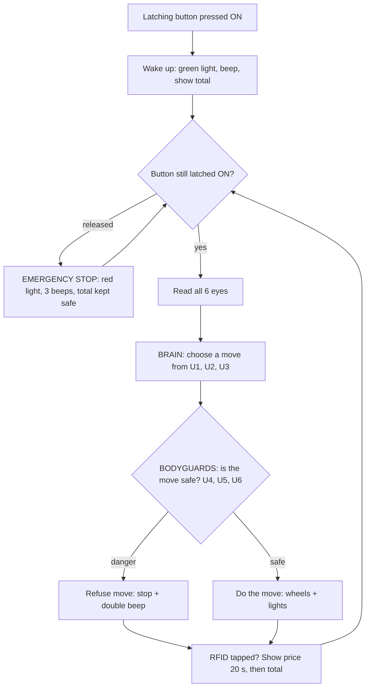

# Cart-E — Human-Following Trolley: Flowchart & Logic Cases (v2)

**Board:** NodeMCU ESP32 (30-pin) on the **Cytron Robo ESP32** (Arduino IDE)
**Status:** matches the tested & calibrated code on GitHub
**Audience:** explainable to Year 6 primary school students

---

## 1. The Six Eyes (Ultrasonic Sensor Layout)

The trolley has **6 ultrasonic sensors**. Explain it to students like this:
*"The trolley has 6 eyes. Three at the front make a fan that watches the
shopper, and three at the back are bodyguards that stop it from bumping
into things."*

```
              [ Person ]
                  |
         \        |        /
        [U2]----[U1]----[U3]     <- front fan: U2/U3 ANGLED OUT 30-45deg
          |               |
          |    CART-E     |
          |   (top view)  |
          |               |
 [U4] <---|               |---> [U5]   <- side guards point SIDEWAYS
          +-----[U6]------+            <- back guard points BACKWARD
                  |
                  v
```

| Sensor | Position & direction | Job |
|--------|----------------------|-----|
| U1 | Front centre, straight ahead | **Front eye** — watches the shopper, measures distance |
| U2 | Front-left, angled outward 30–45° | **Corner eye** — catches the shopper when they turn left |
| U3 | Front-right, angled outward 30–45° | **Corner eye** — catches the shopper when they turn right |
| U4 | Back-left, pointing sideways | **Side guard** — protects the swing when turning left |
| U5 | Back-right, pointing sideways | **Side guard** — protects the swing when turning right |
| U6 | Back centre, pointing backward | **Back guard** — makes reversing safe |

**Wheels:** M1 = left wheel, M2 = right wheel (driver built into the board).

> **Why the angles matter:** if U2/U3 point straight ahead the turning
> feature cannot work — the shopper can never "appear" in a corner eye.
> U4/U5 point sideways (not backward!) because when a trolley rotates,
> its rear corner swings **outward** — that swing is what they protect.

## 2. Components

**Built into the Cytron Robo ESP32 board:**
- Dual DC motor driver (M1 = D12/D13, M2 = D14/D27)
- Piezo buzzer on D23 (mute switch must be ON) — external buzzer joins
  **in parallel** on the same pin, both sing together
- 2× NeoPixel RGB LEDs on D15 — external NeoPixel stick joins **in
  parallel** on the same pin and always copies the same colour
- Li-ion charging + protection, power switch

**Added by us:**
- 6× HC-SR04 ultrasonic sensors
- 1× latching push button (SPST, normally open) = power **and** emergency stop
- PN532 RFID reader (I2C mode) + NTAG213 stickers (13.56 MHz)
- 0.96" OLED SSD1306 (I2C) — item price for 20 s, then running total
- 1-cell Li-ion battery

**Light & sound language:** Green = following · Yellow = wait/confused ·
Red = stopped/asleep · 1 beep = awake · long beep = lost you ·
2 beeps = bodyguard refused · 3 beeps = emergency stop.

## 3. Pin Map (verified against the Cytron datasheet)

| Sensor / part | Connects to | Pins |
|---|---|---|
| U1 front | Grove 1 | trig D16, echo D17 |
| U2 front-left | Grove 3 | trig D26, echo D25 |
| U3 front-right | Grove 5 | trig D33, echo D32 |
| U4 back-left | Servo S pins | trig D4, echo D18 |
| U5 back-right | Servo S pins | trig D5, echo D19 |
| U6 back | Breakout header | trig D2, echo D36 ("VP") |
| Motors M1 / M2 | Built-in terminals | D12/D13 · D14/D27 |
| Buzzer (built-in + external) | D23 | external in parallel |
| NeoPixels (onboard + external) | D15 | external in parallel |
| Latching button | D35 + GND | shares onboard button "1" (board has pull-up) |
| RFID PN532 + OLED | Grove 2 / Maker Port | I2C: SDA D21, SCL D22 |

> Why Grove ports 1, 3, 5 only: neighbouring Grove ports **share a pin**
> (e.g. Grove 3 & 4 both use D25), and Grove 7's pins (D36/D39) are
> input-only — they can hear an echo but can't send a trig pulse.
> Also: the ESP32 has **no pin 24** (numbering skips 24 and 28–31)!

## 4. The Calibrated Distance Rules

All decisions come from these numbers (top of the code — tune there):

| Constant | Value | Meaning |
|---|---|---|
| FOLLOW_DIST | 30 cm | centre of the stop "sweet spot" |
| DEAD_ZONE | ±3 cm | sweet spot = 27–33 cm |
| LOST_DIST | 150 cm | beyond this = shopper is gone |
| PERSON_RANGE | 60 cm | corner eye "sees the shopper" within this |
| GUARD_DIST | 10 cm | bodyguard danger distance |
| SQUEEZE_DIST | 5 cm | sides scraping something |

**The follow bands (U1, front eye):**

```
 0 ........ 27 : REVERSE   (too close — back away politely)
27 ........ 33 : STOP      (the sweet spot)
33 ....... 150 : FORWARD   (follow the shopper)
150 .......... : LOST      (stop + buzzer — "wait for me!")
```

## 5. Main Program Flowchart

The ESP32 repeats this loop about 30 times per second:



Plain-text version:
1. **Button ON?** — released at any moment = emergency stop (total is kept)
2. **Read all 6 eyes**
3. **Brain chooses a move** (from the front fan U1/U2/U3)
4. **Bodyguards check it** (U4/U5/U6) — dangerous moves are refused
5. **Move!** then check RFID and update the screen
6. Repeat forever

**The golden rule: safety always wins over wanting.**

## 6. The Brain's Cases (movement logic v2)

The brain first asks three yes/no questions:
- **personFront?** — is something within 150 cm of the front eye?
- **personLeft?** — is something within 60 cm of the left corner eye?
- **personRight?** — is something within 60 cm of the right corner eye?

| Case | Name | Condition | Action |
|------|------|-----------|--------|
| 1 | Follow | Person in front, 33–150 cm | Both wheels forward |
| 2 | Sweet spot | Person in front, 27–33 cm | Stop (perfect distance) |
| 3 | Personal space | Person in front, under 27 cm | Reverse politely |
| 4 | Abandoned | Nobody in front, nobody in either fan | Stop, long beep, yellow |
| 5 | Chase left | Nobody in front, person in LEFT fan | Spin left until front eye finds them |
| 6 | Chase right | Nobody in front, person in RIGHT fan | Spin right until front eye finds them |
| 11 | Confused | Nobody in front, something in BOTH fans | Wait (yellow) — safer than guessing |
| 12 | Too fast | Was close (< 40 cm), vanished in one step (> 150 cm) | Stop, long beep — "wait for me!" |

**The turning idea (our proudest feature):** when the shopper turns a
corner they *disappear* from the front eye and *appear* in a corner eye —
so the trolley chases **the person**, never empty space.

## 7. The Bodyguards' Cases (safety vetoes)

The bodyguards never choose a move — they only **veto**:

| Case | Name | Condition | Action | Why |
|------|------|-----------|--------|-----|
| 7 | Reverse blocked | Wants REVERSE but U6 < 10 cm | Refuse, stop, 2 beeps | Would back into someone/something |
| 8 | Left turn blocked | Wants TURN LEFT but U4 < 10 cm | Refuse, stop, 2 beeps | Rear corner swings outward when rotating |
| 9 | Right turn blocked | Wants TURN RIGHT but U5 < 10 cm | Refuse, stop, 2 beeps | Same swing, other side |
| 10 | Squeezed | FORWARD but U4 or U5 < 5 cm | Stop, 3 beeps | Scraping along a rack or person |

## 8. System Cases

| Case | Name | Condition | Action |
|------|------|-----------|--------|
| 13 | Emergency stop | Latching button released (any time) | Stop everything, red, 3 beeps — **total kept safe** |
| 14 | Wake up | Button latched ON | Green, happy beep, show total, start following |

**Teaching pattern for students:**
Cases 1–6, 11, 12 are *"what the trolley wants to do."*
Cases 7–10 are *"the bodyguards saying NO."*
Cases 13–14 are *"the one button that rules them all."*

## 9. Known Limitation (be honest — judges love it)

Ultrasonic sensors only measure distance — a human, a rack and a box all
"sound" identical. Cart-E follows **whatever it saw first, like a duckling**.
Our design responds to this honestly: the start ritual tells it who to
follow, the WAIT case stops it guessing, and the bodyguards protect
everything regardless of what it is. Upgrade path (v2): carried beacon,
thermal sensor (AMG8833), or AI camera (HuskyLens).

## 10. Practical Build Notes

- **Sensor timing:** sensors are read one at a time with a small delay —
  they interfere if they ping together.
- **The 20 s price display** uses `millis()` (a stopwatch), never
  `delay()` — the trolley keeps driving while the screen counts down.
- **Registering items:** use the helper sketch `cart_e_rfid_test.ino` —
  tap a sticker and it prints a ready-to-paste `shopItems` line.
- **Wheel spins the wrong way?** Swap that motor's two wires at the green
  terminal — never change the code for this.
- **Sensor always reads 999?** Its Trig/Echo wires are swapped.
- **Buzzer silent?** Check the board's mute switch — and remember the
  buzzer is on **D23** (pin 24 does not exist on the ESP32).
- **Tuning:** all behaviour numbers live in one block at the top of the
  code (`DISTANCE RULES`) — change one number, re-upload, retest.

---

*Repo: https://github.com/bidayatulhidayah/cart-e-smart-trolley*
*Companion guides: movement testing & RFID testing (for Faezah), full
project explanation (for Izzah).*
